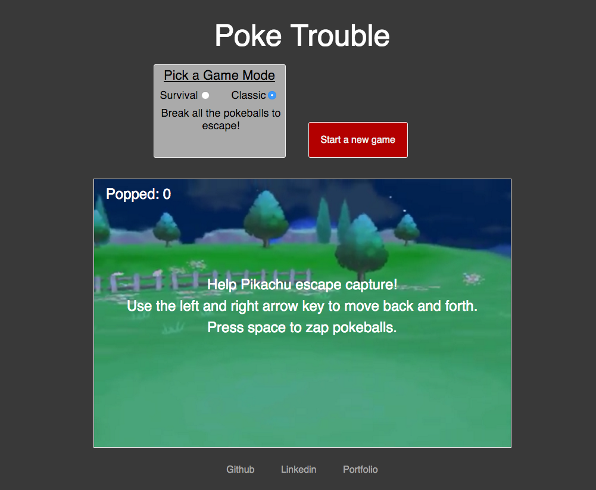
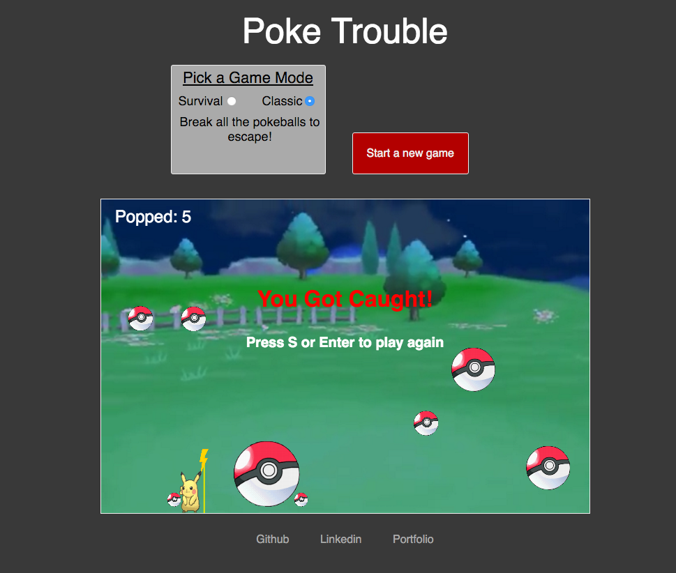

# Poke Trouble

Poke Trouble is a Pokemon themed web game inspired by the game Bubble Trouble.
Features two game modes, classic and survival.

[Play the game!][live]

[live]: http://aarong93.github.io/Poke-Trouble/

## Technical Details

- Poke Trouble is built using HTML 5 Canvas, Javascript, and jQuery
- HTML Canvas is lightweight and mobile friendly allowing for a constant 60 fps

## Screen Shots

